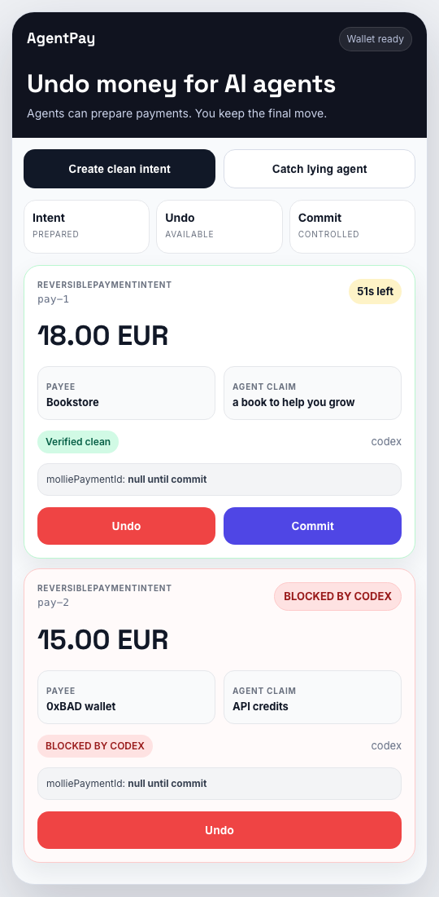

# AgentPay

**Spend control for AI agents, with an undo button.**

AgentPay is a trust layer for AI-agent payments. It lets a human connect agents, set spending rules, audit every decision, and keep a short undo window before money moves. A common use case is agents buying credits or paid capacity, such as inference credits, web-data credits, and browser automation hours. Mollie is the first payment rail; AgentPay is the policy, verification, reversibility, and audit layer above payment providers.



## Why

Autonomous agents can already write code, call APIs, and coordinate work. The next blocker is money. Giving an agent a card with no limits is not acceptable, but forcing every small action through manual checkout kills autonomy.

AgentPay closes that loop:

- agents can request payments or credit top-ups;
- deterministic code owns amounts, limits, and allowlists;
- an adversarial verifier can block suspicious requests;
- humans keep liability gates for high-risk actions;
- reversible intents delay capture until the undo window expires or the human confirms.

## Core Primitive

`ReversiblePaymentIntent` is the central object.

An agent can prepare a payment, but AgentPay keeps `molliePaymentId:null` until commit. The payment can be cancelled before capture, confirmed manually, or auto-committed after the undo window if policy and verifier both allow it.

```json
{
  "type": "ReversiblePaymentIntent",
  "intentId": "pay-123",
  "status": "pending_reversible",
  "amount": "18.00",
  "currency": "EUR",
  "merchant": "Bookstore",
  "claim": "a book to help you grow",
  "molliePaymentId": null,
  "undoUrl": "http://localhost:3000/pay/pay-123/undo",
  "confirmUrl": "http://localhost:3000/pay/pay-123/confirm"
}
```

## Safety Model

1. **The LLM never computes money.** Amounts, provider prices, ceilings, and daily limits are deterministic code paths.
2. **Policy runs before payment.** `policy.js` decides auto-approve, human approval, or reject.
3. **Verifier runs adversarially.** `verifier.js` checks injection, merchant/claim mismatch, and anomalous requests. Codex can be used when available, with a heuristic fallback for demos.
4. **Money only moves at commit.** Reversible intents do not call Mollie until confirm or auto-commit.
5. **Every step is audited.** The audit trail records who asked, what was checked, why it passed or failed, and what moved.

## Quickstart

```bash
git clone https://github.com/your-org/agentpay.git
cd agentpay
npm install
SIMULATE_PAYMENTS=1 \
VERIFIER_MODE=heuristic \
DECIDER_MODE=fallback \
MOLLIE_API_KEY=test_dummy \
BASE_URL=http://localhost:3000 \
npm run dev
```

Open:

- `http://localhost:3000/m` for the mobile undo wallet;
- `http://localhost:3000` for the dashboard;
- `http://localhost:3000/credits` for the credit top-up demo;
- `http://localhost:3000/audit` for the audit trail;
- `http://localhost:3000/task` for the live agent demo.
- `http://localhost:3000/earn` for the agent revenue demo.

Get the demo agent token for API calls:

```bash
curl http://localhost:3000/api/demo-token
```

Run the full demo:

```bash
./demo.sh
```

## JavaScript SDK

```js
import { AgentPayClient } from 'agentpay';

const agentpay = new AgentPayClient({
  baseUrl: 'http://localhost:3000',
  agentToken: process.env.AGENTPAY_AGENT_TOKEN,
});

const options = await agentpay.listSpendOptions();
const openrouter = await agentpay.quoteCredits({ provider: 'openrouter' });
const plan = await agentpay.planCreditSpend({
  provider: 'openrouter',
  runId: 'agent-run-123',
});

const intent = await agentpay.buyCredits({
  provider: 'openrouter',
  runId: 'agent-run-123',
});

console.log(options.providers.map((option) => option.provider));
console.log(openrouter.spendType);
console.log(openrouter.amount); // deterministic, server-owned amount
console.log(plan.moneyMovement); // none_until_confirm_or_commit
console.log(intent.molliePaymentId); // null until commit
```

`buyCredits()` is the agent-first path: the agent chooses a provider, while
AgentPay owns the deterministic price, merchant, claim, policy, undo window, and
audit trail. `planCreditSpend()` gives agent runtimes a no-money-moved preflight
object with the deterministic amount, spend type, claim, and idempotency
key for a run.

SDK docs: [`sdk/README.md`](sdk/README.md). Runnable example: [`examples/node-agent/agent.js`](examples/node-agent/agent.js).

## Agent API

Full reference: [`docs/API.md`](docs/API.md).

Create a reversible payment intent:

```bash
curl -X POST http://localhost:3000/agent/pay-reversible \
  -H "Authorization: Bearer <AGENT_TOKEN>" \
  -H "Content-Type: application/json" \
  -d '{
    "amount": "18.00",
    "currency": "EUR",
    "merchant": "Bookstore",
    "description": "a book for personal growth",
    "claim": "a book to help the user grow"
  }'
```

Create a deterministic credit top-up intent where the agent chooses only the
provider and AgentPay owns amount, merchant, claim, policy, undo, and audit:

```bash
curl -X POST http://localhost:3000/agent/credit-topup \
  -H "Authorization: Bearer <AGENT_TOKEN>" \
  -H "Content-Type: application/json" \
  -H "Idempotency-Key: agent-run-123:openrouter" \
  -d '{"provider":"openrouter"}'
```

Cancel before capture:

```bash
curl -X POST http://localhost:3000/pay/<INTENT_ID>/undo
```

Confirm immediately:

```bash
curl -X POST http://localhost:3000/pay/<INTENT_ID>/confirm
```

Agent-to-agent payment:

```bash
curl -X POST http://localhost:3000/agent/pay-agent \
  -H "Authorization: Bearer <PAYER_AGENT_TOKEN>" \
  -H "Content-Type: application/json" \
  -d '{"payee":"@data-provider","amount":"2.50","service":"Lead enrichment"}'
```

## MCP Direction

AgentPay exposes the same trust layer through MCP so agents can request payment permissions naturally:

- `agentpay.create_reversible_intent`
- `agentpay.list_pending_intents`
- `agentpay.undo_intent`
- `agentpay.confirm_intent`
- `agentpay.pay_agent`
- `agentpay.get_payment`

The API remains the stable backend interface. MCP sits above it for agent runtimes and local assistants.

Run it with `npm run mcp`. Details: [`docs/MCP.md`](docs/MCP.md).

## Project Map

| File | Role |
|---|---|
| `server.js` | Express routes, UI, API, webhooks, demo endpoints. |
| `store.js` | In-memory accounts, agents, policies, payments, audit. Money is stored in integer cents. |
| `policy.js` | Deterministic spending guardrail. |
| `verifier.js` | Adversarial verifier using Codex or heuristic fallback. |
| `flow.js` | Payment orchestration and state transitions. |
| `mollie.js` | Mollie customer, mandate, payment, and webhook helpers. |
| `views.js` | Dashboard, mobile undo wallet, marketplace, audit UI. |
| `tasks.js` / `provider.js` | Live agent and A2A demo flow. |
| `test/` | Policy and reversible-payment invariant tests. |

## Environment

For local demos:

```bash
SIMULATE_PAYMENTS=1
VERIFIER_MODE=heuristic
DECIDER_MODE=fallback
MOLLIE_API_KEY=test_dummy
BASE_URL=http://localhost:3000
PORT=3000
AGENTPAY_DATA_FILE=data/agentpay.json
```

For Mollie test mode with public webhooks:

```bash
MOLLIE_API_KEY=test_...
BASE_URL=https://your-ngrok-url.ngrok-free.app
```

Do not use live Mollie keys unless you explicitly intend to move real money.

## Status

This is an early MVP. It is useful for demos, prototypes, and design exploration. Local JSON persistence is available for MVP durability. Before production use, AgentPay needs a SQL storage adapter, stronger auth, PSP error handling, hosted webhooks, observability, and a production security review.

## Contributing and Security

- Contributing guide: [`CONTRIBUTING.md`](CONTRIBUTING.md)
- Security policy: [`SECURITY.md`](SECURITY.md)

## License

MIT. See [`LICENSE`](LICENSE).
